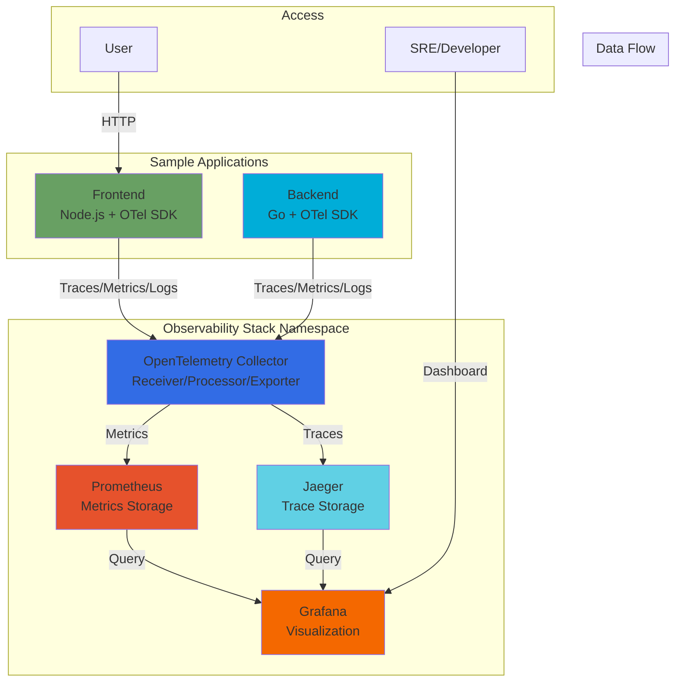

# Kubernetes Observability Stack with OpenTelemetry

[](https://github.com/remmakoshino/k8s-otel-observability-stack/actions)
[](https://opensource.org/licenses/MIT)

本番環境を想定したKubernetes上のObservabilityスタック実装例です。OpenTelemetry、Prometheus、Grafana、Jaegerを統合し、マイクロサービスの分散トレーシング、メトリクス、ログの3本柱を実装しています。

## 🏗️ アーキテクチャ



## ✨ 主な機能

### Observability の3本柱

- **📊 Metrics**: Prometheusによるメトリクス収集・保存、カスタムメトリクス対応
- **🔍 Traces**: Jaegerによる分散トレーシング、リクエストフロー可視化
- **📝 Logs**: 構造化ログ収集（将来的にLokiとの統合も可能）

### 本番想定の設計

- **🔒 セキュリティ**: RBAC設定、リソース制限、Namespace分離
- **📈 SLI/SLO**: カスタムダッシュボードでのSLI計測例
- **🚀 自動化**: Helmチャートによるデプロイ自動化
- **📚 ドキュメント**: 詳細なアーキテクチャ、セットアップ、トラブルシューティング

### サンプルアプリケーション

- **Frontend**: Node.js + Express + OpenTelemetry SDK
- **Backend**: Go + Gin + OpenTelemetry SDK
- 両アプリとも分散トレーシング、カスタムメトリクス、構造化ログを実装

## 🚀 クイックスタート

### 前提条件

- Kubernetes クラスター (minikube推奨)
- kubectl
- helm (オプション)
- Docker

### Minikube セットアップ

```bash
# Minikube起動
./scripts/setup-minikube.sh

# 全コンポーネントのデプロイ
./scripts/deploy-all.sh
```

### アクセス

```bash
# Grafanaダッシュボード (admin/admin)
kubectl port-forward -n observability svc/grafana 3000:3000

# Jaeger UI
kubectl port-forward -n observability svc/jaeger-query 16686:16686

# Prometheus UI
kubectl port-forward -n observability svc/prometheus 9090:9090

# Frontend アプリ
kubectl port-forward -n default svc/frontend 8080:8080
```

### 動作確認

デプロイが完了したら、[動作確認手順](docs/VERIFICATION.md)に従って各コンポーネントが正常に動作していることを確認してください。

**基本的な動作確認:**

```bash
# アプリケーションのテスト
curl http://localhost:8080/api/users

# 全Podの状態確認
kubectl get pods -A

# トレースの生成
for i in {1..5}; do curl -s http://localhost:8080/api/users > /dev/null; sleep 1; done
```

詳細なテスト手順、メトリクスの確認方法、トラブルシューティングについては [VERIFICATION.md](docs/VERIFICATION.md) を参照してください。

## 📁 プロジェクト構成

```
k8s-otel-observability-stack/
├── apps/                       # サンプルアプリケーション
│   ├── frontend/              # Node.js フロントエンド
│   └── backend/               # Go バックエンド
├── kubernetes/                 # Kubernetesマニフェスト
│   ├── namespaces/            # Namespace定義
│   ├── otel-collector/        # OpenTelemetry Collector
│   ├── prometheus/            # Prometheus設定
│   ├── grafana/               # Grafana設定
│   ├── jaeger/                # Jaeger設定
│   └── sample-apps/           # サンプルアプリのデプロイ設定
├── helm/                       # Helmチャート
│   └── observability-stack/
├── scripts/                    # セットアップスクリプト
├── docs/                       # 詳細ドキュメント
└── .github/workflows/         # CI/CD設定
```

## 📖 ドキュメント

- [アーキテクチャ詳細](docs/ARCHITECTURE.md) - システム設計と各コンポーネントの詳細
- [セットアップガイド](docs/SETUP.md) - 環境構築とデプロイ手順
- [動作確認手順](docs/VERIFICATION.md) - デプロイ後の動作確認とテスト方法
- [CI/CDセットアップ](docs/CICD_SETUP.md) - GitHub Actionsによる自動デプロイの設定方法
- [トラブルシューティング](docs/TROUBLESHOOTING.md) - よくある問題と解決方法
- [追加リソース](docs/ADDITIONAL_RESOURCES.md) - 参考資料とベストプラクティス

## 🎯 ユースケース

### 1. 分散トレーシング

フロントエンドからバックエンドへのリクエストフローを可視化:

```bash
# Frontend経由でBackendを呼び出し
curl http://localhost:8080/api/users

# Jaeger UIでトレースを確認
open http://localhost:16686
```

### 2. カスタムメトリクス

SLI/SLO計測のダッシュボード例:
- リクエストレート
- エラーレート
- レイテンシパーセンタイル (p50, p95, p99)
- Apdex スコア

### 3. ログ分析

構造化ログによる詳細な分析:
- リクエストID連携
- エラースタックトレース
- パフォーマンスメトリクス

## 🛠️ 開発

### ローカルでのアプリビルド

```bash
# Backend (Go)
cd apps/backend
go mod download
go run main.go

# Frontend (Node.js)
cd apps/frontend
npm install
npm start
```

### Dockerイメージビルド

```bash
# Backend
docker build -t backend:latest ./apps/backend

# Frontend
docker build -t frontend:latest ./apps/frontend
```

## 📊 Grafanaダッシュボード

プリセットダッシュボード:
1. **Overview Dashboard**: 全体のヘルスチェック
2. **Application Metrics**: アプリケーション固有のメトリクス
3. **SLI/SLO Dashboard**: サービスレベル指標
4. **Trace Analytics**: トレース分析

## 🔧 カスタマイズ

### メトリクスの追加

1. アプリケーションでカスタムメトリクスを定義
2. OpenTelemetry Collectorの設定を更新
3. Grafanaでダッシュボードを作成

詳細は [ARCHITECTURE.md](docs/ARCHITECTURE.md) を参照してください。

## 🤝 コントリビューション

Issue、Pull Requestを歓迎します！

## 📝 ライセンス

MIT License - 詳細は [LICENSE](LICENSE) を参照してください。

## 🙏 謝辞

このプロジェクトは以下のOSSを利用しています:
- [OpenTelemetry](https://opentelemetry.io/)
- [Prometheus](https://prometheus.io/)
- [Grafana](https://grafana.com/)
- [Jaeger](https://www.jaegertracing.io/)

## 📧 お問い合わせ

質問や提案は [GitHub Issues](https://github.com/remmakoshino/k8s-otel-observability-stack/issues) でお願いします。
