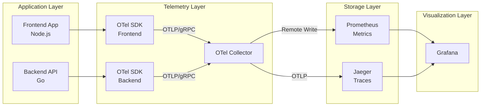

# アーキテクチャ詳細

## 概要

本プロジェクトは、Kubernetes上で動作する本番環境レベルのObservabilityスタックを実装しています。OpenTelemetryを中心に、メトリクス、トレース、ログの3本柱を統合しています。

## システムアーキテクチャ

### コンポーネント構成



## コンポーネント詳細

### 1. OpenTelemetry Collector

**役割**: テレメトリデータの収集、処理、エクスポート

**設定内容**:
- **Receivers**: 
  - OTLP gRPC (4317)
  - OTLP HTTP (4318)
  - Prometheus metrics (8888)
- **Processors**:
  - Batch processor (効率的なデータ送信)
  - Memory limiter (メモリ管理)
  - Resource detection (リソース属性の自動検出)
- **Exporters**:
  - Prometheus (メトリクス)
  - Jaeger (トレース)
  - Logging (デバッグ用)

**リソース制限**:
```yaml
resources:
  requests:
    memory: "256Mi"
    cpu: "100m"
  limits:
    memory: "512Mi"
    cpu: "500m"
```

### 2. Prometheus

**役割**: メトリクスの時系列データベース

**機能**:
- OpenTelemetry Collectorからのメトリクス受信
- Kubernetes APIからのメトリクス収集 (ServiceMonitor)
- 長期保存 (デフォルト15日)
- PromQLによるクエリ

**収集メトリクス**:
- アプリケーションメトリクス (カスタム)
- HTTPリクエストメトリクス
- ランタイムメトリクス (Go, Node.js)
- Kubernetesメトリクス

**RBAC設定**:
```yaml
- Pods, Services, Endpoints の読み取り権限
- ConfigMaps の読み取り権限
```

### 3. Jaeger

**役割**: 分散トレーシングシステム

**コンポーネント**:
- Jaeger Query: UIとクエリAPI
- Jaeger Collector: トレース収集
- Storage: インメモリ (本番環境ではCassandra/Elasticsearch推奨)

**機能**:
- トレースの可視化
- サービス依存関係グラフ
- レイテンシ分析
- エラー追跡

### 4. Grafana

**役割**: 可視化とダッシュボード

**データソース**:
- Prometheus (メトリクス)
- Jaeger (トレース)

**プリセットダッシュボード**:
1. **Overview Dashboard**
   - クラスター全体の健全性
   - リソース使用率
   - サービスステータス

2. **Application Metrics**
   - HTTPリクエストレート
   - レスポンスタイム
   - エラーレート
   - スループット

3. **SLI/SLO Dashboard**
   - Availability (可用性)
   - Latency (レイテンシ)
   - Error Rate (エラー率)
   - Apdex Score

4. **Trace Analytics**
   - トレース統計
   - サービス間レイテンシ
   - ボトルネック分析

## データフロー

### メトリクスフロー

```
Application (OTel SDK) 
  → OTel Collector (OTLP Receiver)
  → OTel Collector (Batch Processor)
  → Prometheus (Remote Write)
  → Grafana (PromQL Query)
```

### トレースフロー

```
Application (OTel SDK)
  → OTel Collector (OTLP Receiver)
  → OTel Collector (Batch Processor)
  → Jaeger Collector
  → Jaeger Storage
  → Jaeger Query UI / Grafana
```

### ログフロー (将来拡張)

```
Application (Structured Logs)
  → OTel Collector (Log Receiver)
  → Loki (Storage)
  → Grafana (LogQL Query)
```

## セキュリティ設計

### Namespace分離

- `observability`: Observabilityスタックコンポーネント
- `default`: サンプルアプリケーション

### RBAC

```yaml
ServiceAccount: prometheus
  Role: prometheus
    - get, list, watch: pods, services, endpoints
```

### Network Policy (オプション)

```yaml
# OTel Collectorへのアクセス制限
- アプリケーションからのみ許可
- 他のNamespaceからは拒否
```

### Resource Quotas

各コンポーネントに適切なリソース制限を設定:
- Memory limits: OOM Killerからの保護
- CPU limits: 他のワークロードへの影響を最小化

## スケーラビリティ

### Horizontal Pod Autoscaler (HPA)

```yaml
# OTel Collector
minReplicas: 2
maxReplicas: 10
targetCPUUtilizationPercentage: 70
```

### Persistent Storage

本番環境では以下を推奨:
- Prometheus: PersistentVolume (30日以上の保持)
- Jaeger: Elasticsearch/Cassandra バックエンド
- Grafana: PostgreSQL/MySQL (ダッシュボード永続化)

## 監視対象メトリクス

### RED Method (Request/Error/Duration)

- **Request Rate**: リクエスト数/秒
- **Error Rate**: エラー率
- **Duration**: レスポンスタイム (P50, P95, P99)

### USE Method (Utilization/Saturation/Errors)

- **Utilization**: CPU/Memory使用率
- **Saturation**: キュー長、待機時間
- **Errors**: エラーカウント

### Golden Signals

- **Latency**: レイテンシ
- **Traffic**: トラフィック量
- **Errors**: エラー率
- **Saturation**: リソース飽和度

## カスタムメトリクス例

### Go Backend

```go
// カウンター
requestCounter := meter.Int64Counter("http.server.requests")

// ヒストグラム
requestDuration := meter.Float64Histogram("http.server.duration")

// アップダウンカウンター
activeConnections := meter.Int64UpDownCounter("http.server.active_connections")
```

### Node.js Frontend

```javascript
// カウンター
const requestCounter = meter.createCounter('http.client.requests');

// ヒストグラム
const requestDuration = meter.createHistogram('http.client.duration');
```

## SLI/SLO設計例

### Availability SLI

```promql
# 99.9% availability target
sum(rate(http_requests_total{status!~"5.."}[5m])) 
/ 
sum(rate(http_requests_total[5m]))
```

### Latency SLI

```promql
# 95% of requests under 200ms
histogram_quantile(0.95, 
  rate(http_request_duration_seconds_bucket[5m])
) < 0.2
```

### Error Budget

```promql
# 30日間のエラーバジェット
1 - ((1 - 0.999) * 30 * 24 * 60 * 60) / 
    sum(increase(http_requests_total[30d]))
```

## トラブルシューティング

詳細は [TROUBLESHOOTING.md](TROUBLESHOOTING.md) を参照してください。

## 参考リンク

- [OpenTelemetry Documentation](https://opentelemetry.io/docs/)
- [Prometheus Best Practices](https://prometheus.io/docs/practices/)
- [Grafana Dashboards](https://grafana.com/grafana/dashboards/)
- [Jaeger Documentation](https://www.jaegertracing.io/docs/)
- [Google SRE Book - Monitoring](https://sre.google/sre-book/monitoring-distributed-systems/)
