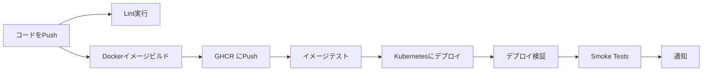

# CI/CD セットアップガイド

このドキュメントでは、GitHub Actionsを使用した自動ビルド・デプロイのセットアップ手順を説明します。

## 概要

このリポジトリには2つのGitHub Actions ワークフローが含まれています:

1. **Lint Workflow** (`lint.yaml`) - コード品質チェック
2. **Deploy Workflow** (`deploy.yaml`) - ビルド・テスト・デプロイ

## 前提条件

- GitHubリポジトリへの管理者アクセス権限
- デプロイ先のKubernetesクラスタ
- `kubectl` コマンドがローカルで使用可能
- Kubernetesクラスタへの接続が確立されていること

## セットアップ手順

### ステップ1: Kubeconfigの準備

#### 1.1 現在のKubeconfigを確認

```bash
# Kubeconfigファイルの場所を確認
echo $KUBECONFIG

# 通常は ~/.kube/config に配置されています
ls -la ~/.kube/config
```

#### 1.2 Kubeconfigの内容を確認

```bash
# Kubeconfigの内容を表示
cat ~/.kube/config
```

**重要な確認事項:**
- クラスタのエンドポイントが外部からアクセス可能であること
- 認証情報（証明書、トークンなど）が含まれていること
- コンテキストが正しく設定されていること

#### 1.3 Kubeconfigのクリーンアップ（オプション）

セキュリティのため、不要なコンテキストやクラスタ情報を削除することを推奨します:

```bash
# 特定のコンテキストのみを含むKubeconfigを作成
kubectl config view --minify --flatten > /tmp/kubeconfig-for-ci.yaml

# 内容を確認
cat /tmp/kubeconfig-for-ci.yaml
```

### ステップ2: KubeconfigをBase64エンコード

#### 2.1 Linux/macOSの場合

```bash
# Base64エンコード（改行なし）
cat ~/.kube/config | base64 -w 0 > /tmp/kubeconfig-base64.txt

# または、クリーンアップ版を使用する場合
cat /tmp/kubeconfig-for-ci.yaml | base64 -w 0 > /tmp/kubeconfig-base64.txt

# エンコードされた内容を表示
cat /tmp/kubeconfig-base64.txt
```

#### 2.2 macOSの場合（-w オプションがない場合）

```bash
# Base64エンコード（改行なし）
cat ~/.kube/config | base64 | tr -d '\n' > /tmp/kubeconfig-base64.txt

# 内容を表示
cat /tmp/kubeconfig-base64.txt
```

#### 2.3 Windowsの場合（PowerShell）

```powershell
# Base64エンコード
$kubeconfigContent = Get-Content -Path "$env:USERPROFILE\.kube\config" -Raw
$bytes = [System.Text.Encoding]::UTF8.GetBytes($kubeconfigContent)
$base64 = [Convert]::ToBase64String($bytes)
$base64 | Out-File -FilePath "$env:TEMP\kubeconfig-base64.txt" -NoNewline

# 内容を表示
Get-Content -Path "$env:TEMP\kubeconfig-base64.txt"
```

#### 2.4 エンコード結果の確認

```bash
# デコードして元の内容が正しいか確認
cat /tmp/kubeconfig-base64.txt | base64 -d > /tmp/kubeconfig-decoded.yaml
diff ~/.kube/config /tmp/kubeconfig-decoded.yaml
```

### ステップ3: GitHub Secretsへの追加

#### 3.1 GitHubリポジトリにアクセス

1. ブラウザで GitHubリポジトリを開く
2. **Settings** タブをクリック
3. 左サイドバーの **Secrets and variables** → **Actions** をクリック

#### 3.2 Secretの作成

1. **New repository secret** ボタンをクリック
2. 以下の情報を入力:
   - **Name**: `KUBECONFIG`
   - **Secret**: Base64エンコードした文字列を貼り付け
     ```
     /tmp/kubeconfig-base64.txt の内容をコピー&ペースト
     ```
3. **Add secret** をクリック

#### 3.3 Secretの確認

Secretsページに `KUBECONFIG` が表示されることを確認してください。

> **Note:** Secretの値は一度保存すると表示できません。正しく設定されたか不安な場合は、後述のテスト手順で確認できます。

### ステップ4: Deploy Workflowの有効化

#### 4.1 deploy.yaml の編集

リポジトリの `.github/workflows/deploy.yaml` ファイルを編集します。

**変更箇所:**

```yaml
      # Note: 本番環境ではクラウドプロバイダーの認証を追加
      # - name: Configure Kubeconfig
      #   run: |
      #     echo "${{ secrets.KUBECONFIG }}" | base64 -d > kubeconfig
      #     export KUBECONFIG=./kubeconfig
```

**↓ 以下のようにコメントアウトを解除:**

```yaml
      # Note: 本番環境ではクラウドプロバイダーの認証を追加
      - name: Configure Kubeconfig
        run: |
          echo "${{ secrets.KUBECONFIG }}" | base64 -d > kubeconfig
          export KUBECONFIG=./kubeconfig
```

#### 4.2 変更をコミット

```bash
# 変更をステージング
git add .github/workflows/deploy.yaml

# コミット
git commit -m "Enable Kubernetes deployment in CI/CD"

# Pushはまだしない（次のステップでテスト後に実行）
```

### ステップ5: デプロイワークフローのテスト

#### 5.1 手動トリガーでテスト

1. GitHubリポジトリの **Actions** タブを開く
2. 左サイドバーから **Deploy** ワークフローを選択
3. **Run workflow** ボタンをクリック
4. **environment** で `development` を選択
5. **Run workflow** をクリック

#### 5.2 ワークフローの実行を監視

1. 実行中のワークフローをクリック
2. 各ジョブの進行状況を確認:
   - ✅ **build-images** - Dockerイメージのビルド
   - ✅ **test-images** - イメージのテスト
   - ✅ **deploy-to-k8s** - Kubernetesへのデプロイ

#### 5.3 デプロイの確認

ワークフローが成功したら、実際にデプロイされたか確認:

```bash
# Podの状態確認
kubectl get pods -n observability
kubectl get pods -l tier=application

# デプロイメント履歴の確認
kubectl rollout history deployment/backend
kubectl rollout history deployment/frontend
```

### ステップ6: 自動デプロイの有効化

#### 6.1 変更をmainブランチにPush

```bash
# 変更をPush
git push origin main
```

#### 6.2 自動デプロイの確認

1. GitHubリポジトリの **Actions** タブを開く
2. 最新のワークフロー実行を確認
3. **Deploy** ワークフローが自動的に開始されることを確認

## セキュリティのベストプラクティス

### 1. 最小権限の原則

Kubernetesの認証情報には、必要最小限の権限のみを付与してください。

**推奨: ServiceAccountの作成**

```yaml
# ci-cd-serviceaccount.yaml
apiVersion: v1
kind: ServiceAccount
metadata:
  name: github-actions-deployer
  namespace: default
---
apiVersion: rbac.authorization.k8s.io/v1
kind: ClusterRole
metadata:
  name: github-actions-deployer
rules:
  - apiGroups: [""]
    resources: ["pods", "services", "configmaps", "secrets"]
    verbs: ["get", "list", "create", "update", "patch", "delete"]
  - apiGroups: ["apps"]
    resources: ["deployments", "replicasets"]
    verbs: ["get", "list", "create", "update", "patch", "delete"]
  - apiGroups: [""]
    resources: ["namespaces"]
    verbs: ["get", "list", "create"]
---
apiVersion: rbac.authorization.k8s.io/v1
kind: ClusterRoleBinding
metadata:
  name: github-actions-deployer
subjects:
  - kind: ServiceAccount
    name: github-actions-deployer
    namespace: default
roleRef:
  kind: ClusterRole
  name: github-actions-deployer
  apiGroup: rbac.authorization.k8s.io
---
apiVersion: v1
kind: Secret
metadata:
  name: github-actions-deployer-token
  namespace: default
  annotations:
    kubernetes.io/service-account.name: github-actions-deployer
type: kubernetes.io/service-account-token
```

**適用:**

```bash
kubectl apply -f ci-cd-serviceaccount.yaml
```

**ServiceAccountのトークンを取得:**

```bash
# トークンを取得
TOKEN=$(kubectl get secret github-actions-deployer-token -o jsonpath='{.data.token}' | base64 -d)

# CA証明書を取得
kubectl get secret github-actions-deployer-token -o jsonpath='{.data.ca\.crt}' > ca.crt

# Kubeconfigを生成
kubectl config set-cluster github-actions-cluster \
  --server=https://YOUR_CLUSTER_ENDPOINT \
  --certificate-authority=ca.crt \
  --embed-certs=true

kubectl config set-credentials github-actions-deployer --token=$TOKEN

kubectl config set-context github-actions \
  --cluster=github-actions-cluster \
  --user=github-actions-deployer

kubectl config use-context github-actions

# 生成されたKubeconfigを保存
kubectl config view --flatten --minify > /tmp/github-actions-kubeconfig.yaml
```

### 2. Secretのローテーション

定期的にKubeconfigやトークンを更新してください:

```bash
# 新しいトークンを生成
kubectl delete secret github-actions-deployer-token
kubectl apply -f ci-cd-serviceaccount.yaml

# 新しいKubeconfigを生成（上記の手順を繰り返す）

# GitHub Secretsを更新
```

### 3. 環境ごとのSecret管理

本番環境と開発環境で異なるSecretを使用することを推奨します:

**GitHub Secrets:**
- `KUBECONFIG_DEV` - 開発環境用
- `KUBECONFIG_STAGING` - ステージング環境用
- `KUBECONFIG_PROD` - 本番環境用

**deploy.yamlの修正例:**

```yaml
- name: Configure Kubeconfig
  run: |
    if [ "${{ github.event.inputs.environment }}" == "production" ]; then
      echo "${{ secrets.KUBECONFIG_PROD }}" | base64 -d > kubeconfig
    elif [ "${{ github.event.inputs.environment }}" == "staging" ]; then
      echo "${{ secrets.KUBECONFIG_STAGING }}" | base64 -d > kubeconfig
    else
      echo "${{ secrets.KUBECONFIG_DEV }}" | base64 -d > kubeconfig
    fi
    export KUBECONFIG=./kubeconfig
```

### 4. ネットワークセキュリティ

- Kubernetesクラスタへのアクセスを特定のIPアドレスに制限
- VPNやプライベートネットワーク経由での接続を検討
- GitHub Actionsのランナーが信頼できるネットワークから実行されることを確認

### 5. 監査ログ

- GitHub Actionsのワークフロー実行履歴を定期的に確認
- Kubernetesの監査ログを有効化
- 不審なアクティビティがないか監視

## トラブルシューティング

### エラー: "error: You must be logged in to the server (Unauthorized)"

**原因:** Kubeconfigの認証情報が無効または期限切れ

**解決方法:**
1. ローカルでKubernetesクラスタに接続できるか確認
   ```bash
   kubectl get nodes
   ```
2. Kubeconfigを再生成してBase64エンコード
3. GitHub Secretsを更新

### エラー: "error: error loading config file: invalid configuration"

**原因:** Base64エンコード/デコードの問題

**解決方法:**
1. Base64エンコードに改行が含まれていないか確認
   ```bash
   # 改行を削除
   cat /tmp/kubeconfig-base64.txt | tr -d '\n' > /tmp/kubeconfig-base64-clean.txt
   ```
2. デコードテスト
   ```bash
   cat /tmp/kubeconfig-base64-clean.txt | base64 -d | kubectl --kubeconfig=- get nodes
   ```

### エラー: "context deadline exceeded"

**原因:** Kubernetesクラスタへのネットワーク接続の問題

**解決方法:**
1. クラスタのエンドポイントが外部からアクセス可能か確認
2. ファイアウォールルールを確認
3. GitHub ActionsのランナーIPアドレスを許可リストに追加

### ワークフローは成功するがPodがデプロイされない

**原因:** イメージのプルに失敗している可能性

**解決方法:**
1. イメージがGHCRに正しくpushされているか確認
   ```bash
   # GitHubのPackagesページで確認
   https://github.com/YOUR_USERNAME/YOUR_REPO/packages
   ```
2. Kubernetesクラスタから GHCR への認証設定を確認
   ```bash
   kubectl create secret docker-registry ghcr-secret \
     --docker-server=ghcr.io \
     --docker-username=YOUR_GITHUB_USERNAME \
     --docker-password=YOUR_GITHUB_TOKEN \
     --docker-email=YOUR_EMAIL
   ```

## 追加のセットアップ（オプション）

### クラウドプロバイダー別の認証設定

#### Google Kubernetes Engine (GKE)

`deploy.yaml`に以下を追加:

```yaml
- name: Authenticate to Google Cloud
  uses: google-github-actions/auth@v1
  with:
    credentials_json: ${{ secrets.GCP_SA_KEY }}

- name: Setup GKE credentials
  uses: google-github-actions/get-gke-credentials@v1
  with:
    cluster_name: your-cluster-name
    location: your-cluster-location
```

**必要なSecret:**
- `GCP_SA_KEY`: サービスアカウントのJSONキー（Base64エンコード不要）

#### Amazon Elastic Kubernetes Service (EKS)

`deploy.yaml`に以下を追加:

```yaml
- name: Configure AWS credentials
  uses: aws-actions/configure-aws-credentials@v4
  with:
    aws-access-key-id: ${{ secrets.AWS_ACCESS_KEY_ID }}
    aws-secret-access-key: ${{ secrets.AWS_SECRET_ACCESS_KEY }}
    aws-region: your-region

- name: Update kubeconfig for EKS
  run: |
    aws eks update-kubeconfig --name your-cluster-name --region your-region
```

**必要なSecret:**
- `AWS_ACCESS_KEY_ID`: AWS アクセスキーID
- `AWS_SECRET_ACCESS_KEY`: AWS シークレットアクセスキー

#### Azure Kubernetes Service (AKS)

`deploy.yaml`に以下を追加:

```yaml
- name: Azure Login
  uses: azure/login@v1
  with:
    creds: ${{ secrets.AZURE_CREDENTIALS }}

- name: Set AKS context
  uses: azure/aks-set-context@v3
  with:
    resource-group: your-resource-group
    cluster-name: your-cluster-name
```

**必要なSecret:**
- `AZURE_CREDENTIALS`: Azureサービスプリンシパルの認証情報（JSON形式）

### Slack/Discord 通知の追加

デプロイ結果を通知するように設定:

**Slack通知の例:**

```yaml
- name: Notify Slack
  if: always()
  uses: slackapi/slack-github-action@v1
  with:
    payload: |
      {
        "text": "Deployment ${{ job.status }}: ${{ github.repository }}@${{ github.ref_name }}"
      }
  env:
    SLACK_WEBHOOK_URL: ${{ secrets.SLACK_WEBHOOK_URL }}
```

**必要なSecret:**
- `SLACK_WEBHOOK_URL`: Slack Incoming Webhook URL

## まとめ

以下の手順でCI/CDパイプラインが完成します:

1. ✅ Kubeconfigの準備とBase64エンコード
2. ✅ GitHub Secretsへの追加
3. ✅ `deploy.yaml`のコメントアウト解除
4. ✅ 手動トリガーでのテスト
5. ✅ mainブランチへのpushで自動デプロイ

**自動化フロー:**



## 参考リンク

- [GitHub Actions Documentation](https://docs.github.com/en/actions)
- [GitHub Encrypted Secrets](https://docs.github.com/en/actions/security-guides/encrypted-secrets)
- [Kubernetes RBAC](https://kubernetes.io/docs/reference/access-authn-authz/rbac/)
- [kubectl Configuration](https://kubernetes.io/docs/tasks/access-application-cluster/configure-access-multiple-clusters/)

---

質問や問題が発生した場合は、[GitHub Issues](https://github.com/remmakoshino/k8s-otel-observability-stack/issues)で報告してください。
